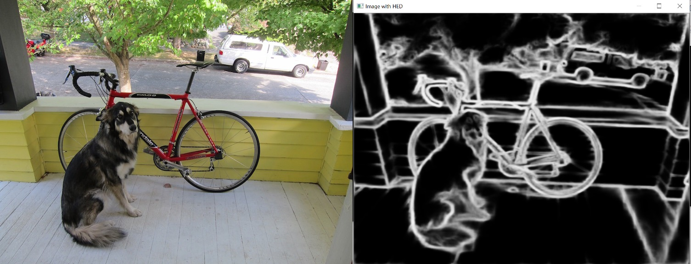

# Deep Learning approach to edge detection. Implementation of Holistically-Nested Edge Detection in C++.

Use ``CMake`` to build project. If you encounter any error, look inside the CMake file, it probably has to do with path or the name of the files.

Don't forget to include the path of ``deploy.prototxt`` and ``hed_pretrained_bsds.caffemodel``.

[Click Here](https://drive.google.com/file/d/1fnA4NJSqJRcbQW170VHvfzrcaJD56Vkg/view?usp=sharing) to download Caffe Model. The ``deploy.prototxt`` is inside the dependencies directory.

Image after HED edge detection:

